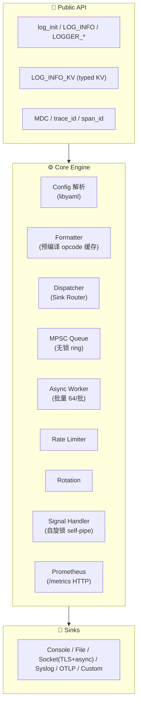
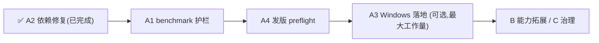

# clogx Roadmap

> 版本: 基于当前 `master`(0.2.1, 439 commits)代码分析与现状整理。
> 目的: 记录项目现状评估、薄弱点与后续方向,供后续迭代与发布规划参考。

## 1. 现状全景

`clogx` 是一个成熟的 C99 日志库,处于**功能完备、工程硬化充分**的状态。

| 维度 | 状态 |
|------|------|
| 架构层次 | Core(`core/`) / Sinks(`sinks/`) / 公共 API(`include/`)三层清晰解耦 |
| 代码规模 | 核心 + sink 约 7,868 行 C |
| 测试 | 44 个测试全部通过(100%),覆盖多实例、fork 安全、信号、TLS、KV、OTLP、queue、rotate 等 |
| 硬化 | 67 符号锁定 ABI(`clogx.map` / `clogx.exports`)、97.8%+ 分支覆盖、clang-tidy 零警告、ASan/TSan/UBSan 可构建 |
| 性能 | 无锁 MPSC 环(seq CAS)、格式串预编译缓存、批量出队(64/批)、fast_ascii LUT |
| 可观测 | Prometheus /metrics、stats API、MDC 线程上下文、trace_id/span_id |
| 打包 | vcpkg + Conan 双发行、Doxygen + GitHub Pages |
| 对比 | 无 TODO/FIXME 残留(源码 0 个) |

### 架构

## 2. 薄弱点与具体差距(基于代码实况)

1. **Windows 为 best-effort**:`plugin_loader.c`(dlopen)、`signal_handler.c`(self-pipe)、自旋锁等价物在 Windows 上是 **stub**,真实 Windows 能力受限。
2. **benchmark 无回归护栏**: 已有 `.github/workflows/benchmark.yml`,但**只运行并记录日志,不设 baseline 阈值,倒退不会让 CI 失败**。
3. **vcpkg/构建依赖不一致(bug)**: [vcpkg.json](/data/home/quintin/workspace/source/c/clog/vcpkg.json) 声明 `yaml-cpp`,
   而 CMake/CPack 实际用的是 **`libyaml`**(`yaml_parser_*`, C 解析器),拉包会拉错依赖。
4. **发布定制只到 0.2.1**: ABI 以 `0_2` 锁定;ECS 到 0.3.0 需走 CONTRIBUTING 的 bump 规则。
5. 文档(README/user_manual 中英文并存)历史上做过多次小型修正,但**无集中 roadmap 追踪**。

> 注: 运行时无 C++ 依赖 —— 唯一 C++ 是 clang-tidy 自定义检查(仅用期构建工具)。'去 C++ 依赖' 结论已达成,无需作为目标。

## 3. 后续方向(候选)

### 方向 A: 发布就绪 (0.3.0 打磨)

| 项 | 工作 | 优先级 |
|----|------|--------|
| A1 | **benchmark 回归护栏** — benchmark.yml 加入 baseline 存储 + 阈值退出(吞吐/延迟倒退 >X% 则失败) | 高(小) |
| A2 | **修复 vcpkg/gh 依赖一致 Bug** — vcpkg.json 改 `libyaml`、删除 `yaml-cpp`,对齐 CMake/CPack | ✅ 已完成 |
| A3 | **Windows(以线) 实现** — 信号(WaitForSingleObject 等价物)、插件(LoadLibrary)、自旋 pipe → socket 等价;添加 Windows CI | 中(大) |
| A4 | **0.3.0 preflight** — ABI `0_2`→`0_3` bump、VERSION/CHANGELOG/版本一致性检查、release 流程演练 | 中(小) |

### 方向 B: 能力拓展

- 更多 sink(fluent/forward、journald、gRPC)、结构化日志增强
- 日志脱敏 / 过滤链 / span 全链路集成

### 方向 C: 生态 / 治理

- 多 CI 平台(Windows/arm)、roadmap 文档本身、团队协作发行说明

## 4. 推荐路线

**优先小、确定性提升,再投入大工程**:

- 阶段 1: A2 + A1 + A4(老小、确定的硬化,可直接发 0.3.0)
- 阶段 2: A3(Windows 真实落地),视资源取舍
- 阶段 3: B / C(生态与能力扩展)

## 5. 说明

- 本文档为**纯方向规划**,未涉及设计(spec)与实现(plan)。
- 各方向如需实施,建议按项目惯例在 `docs/superpowers/specs/` 与 `plans/` 分别补充设计与计划文件后再动手。