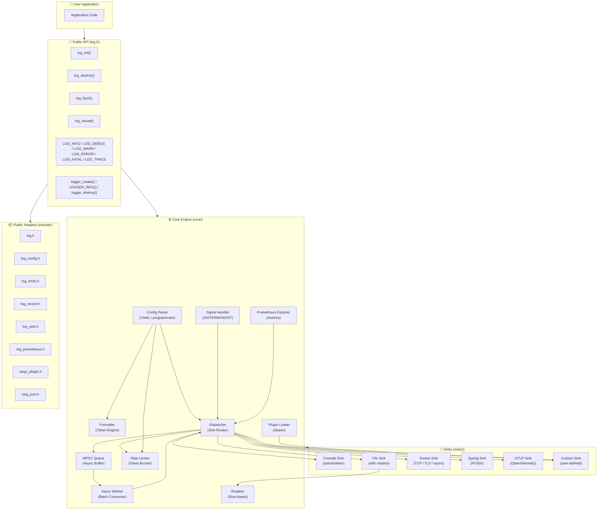
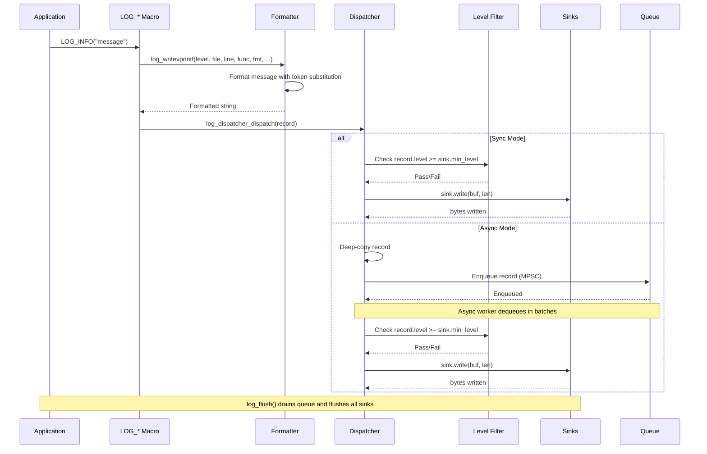
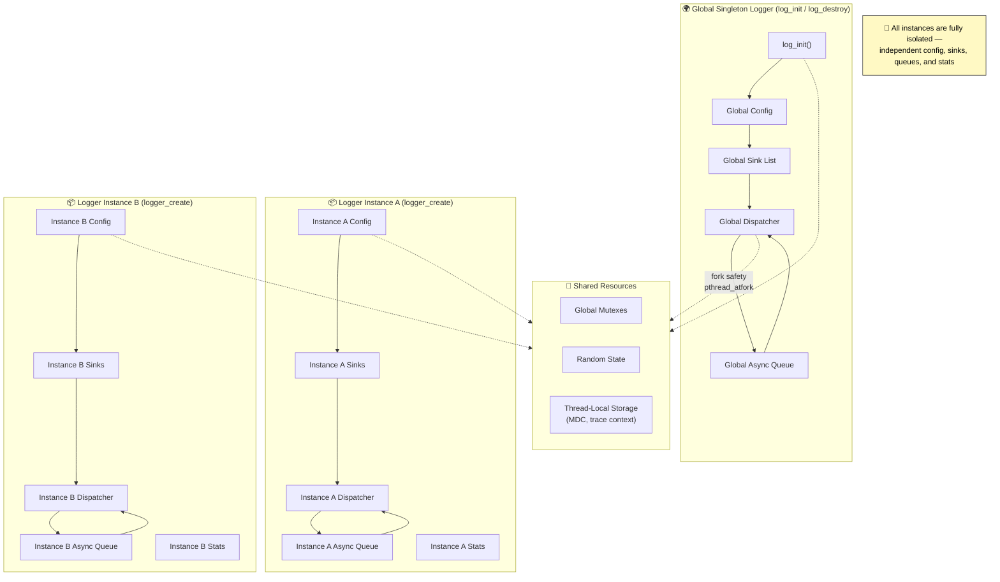

# clogx User Manual (English Version)

## Table of Contents

1. [Introduction](#1-introduction)
2. [Building and Installation](#2-building-and-installation)
   - [Build with Makefile](#21-build-with-makefile)
   - [Build with CMake](#22-build-with-cmake)
   - [Installing the Library](#23-installing-the-library)
3. [Quick Start](#3-quick-start)
   - [Using YAML Configuration File](#31-using-yaml-configuration-file)
   - [Programmatic Configuration](#32-programmatic-configuration)
   - [Using the Macro API](#33-using-the-macro-api)
4. [Configuration Reference](#4-configuration-reference)
   - [YAML Config Format](#41-yaml-config-format)
   - [Legacy Config Format](#42-legacy-config-format)
   - [Configuration Keys Reference](#43-configuration-keys-reference)
   - [Configuring Programmatically](#44-configuring-programmatically)
   - [Format Tokens](#45-format-tokens)
5. [Usage Examples](#5-usage-examples)
   - [Basic Console Logging](#51-basic-console-logging)
   - [File Logging with Rotation](#52-file-logging-with-rotation)
   - [JSON Structured Logging](#53-json-structured-logging)
   - [Multi-Sink Setup](#54-multi-sink-setup)
   - [Asynchronous Logging](#55-asynchronous-logging)
   - [Socket Sink with TLS](#56-socket-sink-with-tls)
   - [Async Non-Blocking Socket Sink](#57-async-non-blocking-socket-sink)
   - [Multi-Instance Logger](#58-multi-instance-logger)
6. [Advanced Features](#6-advanced-features)
   - [Async Fallback Callback](#61-async-fallback-callback)
   - [Per-Sink Level Filtering](#62-per-sink-level-filtering)
   - [Rate Limiting](#63-rate-limiting)
   - [Hot Reload Configuration](#64-hot-reload-configuration)
   - [Fork Safety](#65-fork-safety)
   - [Signal Handling and Graceful Shutdown](#66-signal-handling-and-graceful-shutdown)
7. [API Reference](#7-api-reference)
   - [Core Functions](#71-core-functions)
   - [Sink Management](#72-sink-management)
   - [Logging Macros](#73-logging-macros)
   - [Multi-Instance Logger API](#74-multi-instance-logger-api)
   - [Error Codes](#75-error-codes)
8. [Custom Sinks](#8-custom-sinks)
9. [Porting to Windows](#9-porting-to-windows)
10. [Troubleshooting](#10-troubleshooting)
11. [Security Considerations](#11-security-considerations)
12. [License](#12-license)

---

## 1. Introduction

**clogx** is a lightweight, high-performance C99 logging library designed for production applications. It provides:

- **Macro API**: Simple logging macros (`LOG_INFO`, `LOG_DEBUG`, `LOG_WARN`, `LOG_ERROR`, `LOG_FATAL`, `LOG_TRACE`)
- **Multi-sink output**: Console (with optional ANSI colors), file (with auto-directory creation and rotation), and TCP socket (optional TLS encryption)
- **Structured logging**: Native single-line JSON format with RFC 8259 string escaping
- **Config-driven**: YAML configuration file supports all runtime settings
- **Async mode**: Background worker thread decouples logging from application performance
- **Size-based rotation**: Automatic log file rotation based on size limit
- **Cross-platform build**: Both Makefile and CMake build systems with CTest support; `include/clog_port.h` centralizes POSIX / Windows adaptations (mutexes, threads, sockets, time functions)
- **Version banner**: every successful `log_init()` / `logger_create()` prints `[clogx] version X.Y.Z` to stderr

---

## Architecture Overview



The diagram above shows the high-level architecture of clogx:

- **User API** — `log_init()`, `LOG_INFO()` macros, and the multi-instance `logger_t` API
- **Core Engine** — config parsing, token-based formatting, sink dispatching, async queue, rate limiter, file rotation, signal handling, plugin loading, and Prometheus metrics export
- **Sinks** — console, file (with rotation), TCP/TLS socket, POSIX syslog, OpenTelemetry OTLP, and custom user-defined sinks
- **Public Headers** — all stable API headers under `include/`

### Log Message Flow



In **sync mode**, the LOG macro formats the message and dispatches it directly to all enabled sinks. In **async mode**, the record is deep-copied into the MPSC queue and dequeued in batches by the background worker thread, which then dispatches to sinks. `log_flush()` drains the queue and flushes all sinks before returning.

### Multi-Instance Logger



The global singleton logger (created by `log_init()`) coexists with independent `logger_t` instances (created by `logger_create()`). Each instance has its own config, sink list, async queue, rate limiter, and statistics. All instances share thread-local storage for MDC context and trace/span IDs.

---

## 2. Building and Installation

### 21 Build with Makefile

```bash
# Build default static and shared libraries
make

# Build with OpenSSL TLS socket sink support
make TLS=1

# Build example binary
make example
```

The build generates:
- `build/libclogx.a` — static library
- `build/libclogx.so` — shared library (soname: `libclogx.so.0`)
- `build/example` — demo binary

### 22 Build with CMake

```bash
cmake -S . -B build
cmake --build build -j
ctest --test-dir build --output-on-failure
```

Common CMake options:

| Option | Default | Description |
|--------|---------|-------------|
| `CLOG_BUILD_EXAMPLES` | ON | Build example programs |
| `CLOG_BUILD_TESTS` | ON | Build and register CTest targets |
| `CLOG_BUILD_BENCHMARKS` | OFF | Build benchmark programs |
| `CLOG_BUILD_SHARED` | OFF | Build shared library when ON |
| `CLOG_USE_SYSTEM_YAML` | OFF | Use system libyaml instead of auto-download |
| `CLOG_ENABLE_TLS` | OFF | Enable OpenSSL TLS support for socket sink |
| `CLOG_ENABLE_CLANG_TIDY` | OFF | Enable clang-tidy static analysis during compilation |
| `CLOG_BUILD_CLANG_TIDY_CHECKS` | OFF | Build custom clang-tidy checks (unused-includes) |
| `CMAKE_EXPORT_COMPILE_COMMANDS` | ON | Auto-generate `compile_commands.json` for clangd/LSP |

### 23 Installing the Library

```bash
# Install using Makefile
make install

# Install using CMake
cmake --install build --prefix /usr/local
```

After installation:
- Static library: `/usr/local/lib/libclogx.a`
- Shared library: `/usr/local/lib/libclogx.so.0` and symlink `/usr/local/lib/libclogx.so`
- Headers: `/usr/local/include/clogx/log.h`, `/usr/local/include/clogx/log_config.h`, etc.
- pkg-config: `pkg-config --cflags --libs clogx`

---

## 3. Quick Start

### 31 Using YAML Configuration File

Place a `config.yaml` in your working directory (or any path passed to `log_init()`):

```yaml
log:
  level: INFO
  async: false
  queue_size: 8192
  color: true
  format: "[%time] [%level] %msg"
  console_enable: true
  file_enable: true
  file_path: logs/app.log
  max_size: 100MB
  backups: 10
```

In your C code:

```c
#include "log.h"

int main(void) {
    /* Initialize logging from YAML config */
    if (log_init("./config.yaml") != 0) {
        return 1;
    }

    LOG_INFO("Server started");
    LOG_WARN("Disk space low: %d%%", 85);
    LOG_ERROR("Failed to connect to database");

    log_flush();
    log_destroy();
    return 0;
}
```

Compile and run:

```bash
gcc -Iinclude app.c -Lbuild -lclogx -lpthread -o app
./app
```

### 32 Programmatic Configuration

When you don't want to use a YAML file, configure programmatically:

```c
#include "log.h"
#include "log_config.h"

int main(void) {
    log_config_t cfg = {0};
    cfg.level = LOG_LEVEL_DEBUG;
    cfg.async = false;
    cfg.color = true;
    cfg.format = "[%time] [%level] [%module] %msg";
    cfg.time_format = "%Y-%m-%d %H:%M:%S";
    cfg.console_enable = true;
    cfg.file_enable = true;
    snprintf(cfg.file_path, sizeof(cfg.file_path), "logs/debug.log");
    cfg.file_max_size = 50 * 1024 * 1024;  /* 50 MB */
    cfg.file_backups = 3;

    if (log_config_set(&cfg) != 0) {
        return 1;
    }

    LOG_INFO("Application started");
    log_flush();
    log_destroy();
    return 0;
}
```

### 33 Using the Macro API

After initialization, use the logging macros:

```c
LOG_TRACE("Trace message: %d", value);
LOG_DEBUG("Debug: %s", msg);
LOG_INFO("Info: %f", float_val);
LOG_WARN("Warning: %d%% done", percent);
LOG_ERROR("Error occurred: %s", strerror(errno));
LOG_FATAL("Fatal error, aborting");
```

Each macro expands to a call to `log_writevprintf()` with compile-time format string checking.

---

## 4. Configuration Reference

### 41 YAML Config Format

The recommended YAML format has a top-level `log:` mapping containing all configuration keys:

```yaml
log:
  level: INFO
  async: false
  queue_size: 8192
  color: true
  format: "[%time] [%level] %msg"
  time_format: "%Y-%m-%d %H:%M:%S"
  console_enable: true
  console_stderr: false
  file_enable: true
  file_path: logs/server.log
  max_size: 100MB
  backups: 10
  socket_enable: false
  rate_limit_enable: false
  rate_limit_max_per_sec: 1000
  rate_limit_burst: 100
```

### 42 Legacy Config Format

For backward compatibility, the old-style top-level key:value pairs (without the `log:` wrapper) are also accepted:

```yaml
level: INFO
async: false
queue_size: 8192
color: true
format: "[%time] [%level] %msg"
console_enable: true
file_enable: true
file_path: logs/server.log
max_size: 100MB
backups: 10
```

Both formats are fully supported. New users should prefer the nested `log:` format.

### 43 Configuration Keys Reference

#### Core Settings

| Key | Type | Default | Description |
|-----|------|---------|-------------|
| `level` | enum | `INFO` | Minimum log level: `TRACE`, `DEBUG`, `INFO`, `WARN`, `ERROR`, `FATAL` |
| `async` | bool | `false` | Enable background consumer thread for async mode |
| `queue_size` | int | `8192` | Async queue capacity (only used when `async: true`) |
| `color` | bool | `true` | Enable ANSI color in console output (disabled for file/socket) |
| `format` | string | `[%time] [%level] %msg` | Log line format template or `"json"` for structured JSON |
| `time_format` | string | `%Y-%m-%d %H:%M:%S` | strftime template for `%time` token; microseconds always appended |

#### Console Sink Settings

| Key | Type | Default | Description |
|-----|------|---------|-------------|
| `console_enable` | bool | `false` | Enable console output sink |
| `console_stderr` | bool | `false` | Write to stderr instead of stdout |

#### File Sink Settings

| Key | Type | Default | Description |
|-----|------|---------|-------------|
| `file_enable` | bool | `false` | Enable file output sink |
| `file_path` | string | `""` | Path to log file (parent directories auto-created) |
| `max_size` | uint64 | `0` | Rotate when file reaches this size (suffix K/KB, M/MB, G/GB) |
| `backups` | int | `0` | Number of rotated files to retain (.1 … .N) |

#### Socket Sink Settings

| Key | Type | Default | Description |
|-----|------|---------|-------------|
| `socket_enable` | bool | `false` | Enable TCP socket output sink |
| `socket_host` | string | `"127.0.0.1"` | Host/IP address to bind/connect to |
| `socket_port` | int | `0` | Port number (1–65535) |
| `socket_tls` | bool | `false` | Enable TLS encryption for socket sink |
| `socket_tls_ca_file` | string | `""` | Path to CA certificate file (for verification) |
| `socket_tls_skip_verify` | bool | `false` | Skip server certificate verification |
| `socket_async` | bool | `false` | Enable async non-blocking socket with ring buffer and exponential backoff |
| `socket_ring_capacity` | int | `8192` | Ring buffer capacity for async socket (number of lines) |
| `socket_backoff_min_ms` | int | `1000` | Initial reconnect backoff delay in milliseconds |
| `socket_backoff_max_ms` | int | `60000` | Maximum reconnect backoff delay in milliseconds |
| `socket_connect_timeout_ms` | int | `1000` | Socket connection and TLS handshake timeout in milliseconds |

#### Rate Limiter Settings (token bucket algorithm)

| Key | Type | Default | Description |
|-----|------|---------|-------------|
| `rate_limit_enable` | bool | `false` | Enable global rate limiting |
| `rate_limit_max_per_sec` | int | `0` | Maximum allowed log messages per second |
| `rate_limit_burst` | int | `0` | Burst capacity (additional tokens allowed initially) |

#### Signal Handling & Prometheus Settings

| Key | Type | Default | Description |
|-----|------|---------|-------------|
| `catch_signals` | bool | `true` | Catch `SIGTERM`/`SIGINT` for graceful shutdown (flush logs, then re-raise) |
| `prometheus_enable` | bool | `false` | Enable Prometheus HTTP /metrics exporter |
| `prometheus_port` | int | `0` | Prometheus /metrics HTTP port (1–65535) |

### 44 Configuring Programmatically

Use the `log_config_t` struct for programmatic configuration (abridged — see `include/log_config.h` for the complete definition):

```c
typedef struct {
    log_level_t level;              /* min log level */
    bool async;                     /* enable async mode */
    int  queue_size;                /* async queue capacity (when async=true) */
    bool color;                     /* enable console coloring */
    log_format_type_t format_type;  /* TEXT or JSON/OTEL mode */
    const char *format;             /* format template or "json" (owned by library) */
    const char *time_format;        /* strftime template */
    int  console_enable;            /* enable console sink */
    int  console_stderr;            /* console to stderr */
    int  file_enable;               /* enable file sink */
    char file_path[CLOG_MAX_PATH_SIZE]; /* file path */
    uint64_t file_max_size;         /* file rotation threshold (bytes) */
    int  file_backups;              /* number of backup files */
    int  socket_enable;             /* enable socket sink */
    char socket_host[CLOG_MAX_PATH_SIZE]; /* socket host */
    int  socket_port;               /* socket port */
    bool socket_tls;                /* enable TLS on socket */
    char socket_tls_ca_file[CLOG_MAX_PATH_SIZE]; /* TLS CA file */
    bool socket_tls_skip_verify;    /* skip TLS cert verification */
    bool socket_async;              /* async non-blocking socket */
    size_t socket_ring_capacity;    /* ring buffer capacity (0 = 8192) */
    uint32_t socket_backoff_min_ms; /* initial reconnect backoff (0 = 1000) */
    uint32_t socket_backoff_max_ms; /* max reconnect backoff (0 = 60000) */
    uint32_t socket_connect_timeout_ms; /* connect/TLS handshake timeout (0 = 1000) */
    bool rate_limit_enable;         /* enable rate limiter */
    int  rate_limit_max_per_sec;    /* max messages/sec */
    int  rate_limit_burst;          /* burst capacity */
    bool catch_signals;             /* catch SIGTERM/SIGINT for graceful shutdown */
    bool prometheus_enable;         /* enable Prometheus /metrics endpoint */
    int  prometheus_port;           /* metrics HTTP port */
    /* ... plugin sink arrays (plugin_so_paths, plugin_params_json, plugin_count) */
} log_config_t;
```

Set configuration via `log_config_set()` (returns 0 on success). Get current config via `log_config_get()`.

### 45 Format Tokens

| Token | Content |
|-------|---------|
| `%time` | local time `YYYY-MM-DD HH:MM:SS.uuuuuu` |
| `%level` | level name (`TRACE` … `FATAL`) |
| `%msg` | message body |
| `%thread` | thread ID |
| `%pid` | process ID |
| `%file` / `%line` / `%func` | source location |
| `%module` / `%tag` | module and tag |
| `%trace_id` / `%span_id` | W3C TraceContext trace/span ID hex strings (when present) |
| `%newline` | literal newline |

Example: `[%time] [%level] %file:%line %msg`

---

## 5. Usage Examples

### 51 Basic Console Logging

```c
#include "log.h"

int main(void) {
    log_init(NULL);  /* Uses ./config.yaml by default */
    log_set_module("myapp");

    LOG_INFO("Application started");
    LOG_DEBUG("Debug value: %d", 42);
    LOG_WARN("Low memory warning");
    LOG_ERROR("Something went wrong");
    LOG_FATAL("Critical failure — exiting");

    log_flush();
    log_destroy();
    return 0;
}
```

Config (`config.yaml`):
```yaml
log:
  level: DEBUG
  async: false
  color: true
  format: "[%time] [%level] %msg"
  console_enable: true
  file_enable: false
```

### 52 File Logging with Rotation

```c
#include "log.h"

int main(void) {
    log_init("./config.yaml");
    LOG_INFO("Log file will rotate automatically");
    log_flush();
    log_destroy();
    return 0;
}
```

Config (`config.yaml`):
```yaml
log:
  level: INFO
  async: false
  file_enable: true
  file_path: logs/app.log
  max_size: 100MB      /* Rotate at 100 megabytes */
  backups: 5           /* Keep 5 rotated copies */
  console_enable: false
```

When the file reaches 100MB, it's renamed to `app.log.1`, the old `.1` becomes `.2`, etc., up to 5 backups. The active file starts fresh.

### 53 JSON Structured Logging

```c
#include "log.h"

int main(void) {
    log_init("./config.yaml");
    LOG_INFO_KV("User logged in", CLOG_KV_STR("user_id", "12345"));
    LOG_ERROR_KV("Database query failed", CLOG_KV_INT("duration_ms", 450),
                 CLOG_KV_STR("table", "users"));
    log_flush();
    log_destroy();
    return 0;
}
```

Config (`config.yaml`):
```yaml
log:
  level: INFO
  format: "json"      /* Single-line JSON output */
  console_enable: true
  file_enable: true
```

Output (example):
```json
{"timestamp":"2024-01-15 10:30:00.123456","level":"INFO","module":"auth","file":"login.c","line":42,"func":"user_login","thread":1234,"pid":5678,"tag":"","message":"User logged in"}
```

All string fields are escaped according to RFC 8259 (quotes, backslashes, newlines, control bytes).

### 54 Multi-Sink Setup

Write to both console AND file simultaneously:

```c
#include "log.h"
#include "log_sink.h"

int main(void) {
    log_init(NULL);

    /* Create a custom file sink with different level filtering */
    log_sink_t *file_sink = file_sink_create("logs/errors.log", 100*1024*1024, 5);
    log_sink_set_level(file_sink, LOG_LEVEL_ERROR);  /* errors and above only */
    log_add_sink(file_sink);  /* Added after log_init() */

    LOG_INFO("This goes to console only");
    LOG_ERROR("This goes to both console and file");

    /* Clean up: destroy added sinks separately on reload or destroy */
    file_sink->destroy(file_sink);  /* Caller owns destruction */
    log_flush();
    log_destroy();
    return 0;
}
```

You can add multiple custom sinks. Note that custom sinks added via `log_add_sink()` are discarded on `log_reload()` — recreate them as needed.

### 55 Asynchronous Logging

Decouple log production from log I/O for high-throughput applications:

```c
#include "log.h"

int main(void) {
    /* Configure async mode */
    log_config_t cfg = {0};
    cfg.level = LOG_LEVEL_INFO;
    cfg.async = true;
    cfg.queue_size = 8192;
    cfg.console_enable = true;
    cfg.file_enable = true;
    snprintf(cfg.file_path, sizeof(cfg.file_path), "logs/async.log");
    log_config_set(&cfg);

    /* Fast logging — calls return immediately */
    for (int i = 0; i < 10000; i++) {
        LOG_INFO("Batch message %d", i);
    }

    /* Wait for all pending logs to be written */
    log_flush();
    log_destroy();
    return 0;
}
```

Config (`config.yaml`):
```yaml
log:
  level: INFO
  async: true
  queue_size: 8192
  console_enable: true
  file_enable: true
  file_path: logs/async.log
```

The async path makes a deep copy of each log record before enqueuing, so stack-allocated pointers remain valid in the producer. If the async queue fills up (worker thread falling behind), an async fallback callback is triggered (see §6.1).

### 56 Socket Sink with TLS (Requires TLS=1 Build)

```c
#include "log.h"
#include "log_sink.h"

int main(void) {
    /* Create a TLS-enabled socket sink */
    log_sink_t *sink = socket_sink_create_tls(
        "logs.example.com",      /* host */
        443,                     /* port */
        true,                    /* use_tls */
        "certs/ca.crt",          /* ca_file (optional, use "" for none) */
        false                    /* skip_verify (false = verify cert) */
    );

    if (sink == NULL) {
        /* Handle error */
        return 1;
    }

    log_add_sink(sink);
    LOG_INFO("Secure log message sent over TLS");

    /* When done, caller must destroy the sink */
    sink->destroy(sink);
    log_flush();
    log_destroy();
    return 0;
}
```

Build with TLS support:
```bash
make TLS=1
```

Or with CMake:
```bash
cmake -S . -B build -DCMAKE_EXPORT_COMPILE_COMMANDS=ON -DCLOG_ENABLE_TLS=ON
cmake --build build
```

### 57 Async Non-Blocking Socket Sink

For high-throughput logging where the application must never block on network I/O, use `socket_sink_create_async`. Log lines are enqueued into a lock-free ring buffer (lossy on overflow) and sent by a background writer thread over a non-blocking TCP/TLS socket. Reconnection uses exponential backoff with jitter to avoid tight reconnect loops when the receiver is down.

```c
#include "log.h"
#include "log_sink.h"

int main(void) {
    /* Async socket: ring capacity 16384, backoff 500ms–30s */
    log_sink_t *sink = socket_sink_create_async(
        "logs.example.com",      /* host */
        5000,                    /* port */
        false,                   /* use_tls */
        NULL,                    /* ca_file (NULL for plain TCP) */
        false,                   /* skip_verify */
        16384,                   /* ring_capacity (0 = default 8192) */
        500,                     /* backoff_min_ms (0 = default 1000) */
        30000                    /* backoff_max_ms (0 = default 60000) */
    );

    log_add_sink(sink);
    LOG_INFO("This enqueue returns immediately (non-blocking)");

    log_flush();
    sink->destroy(sink);
    log_destroy();
    return 0;
}
```

Or via YAML config:

```yaml
log:
  socket_enable: true
  socket_host: "logs.example.com"
  socket_port: 5000
  socket_async: true
  socket_ring_capacity: 16384
  socket_backoff_min_ms: 500
  socket_backoff_max_ms: 30000
```

**Behavior:**
- Log lines are copied into the ring buffer and returned immediately (non-blocking).
- If the ring is full, the oldest entry is dropped (lossy backpressure — logging must never block the application).
- The writer thread connects in non-blocking mode with a 1-second select timeout.
- On send/connect failure, the writer sleeps with exponential backoff (doubles each failure, capped at `socket_backoff_max_ms`, ±10% jitter).
- On successful send, backoff resets to `socket_backoff_min_ms`.
- On shutdown (`sink->destroy(sink)`), the writer drains remaining entries before exiting.

### 58 Multi-Instance Logger

Create and manage independent logger instances, each with its own config, sinks, and async worker:

```c
#include "log.h"
#include "log_config.h"

int main(void) {
    /* Create a logger from YAML config */
    logger_t *app_logger = logger_create("./config.yaml");

    /* Or from programmatic config */
    log_config_t cfg = {0};
    cfg.level = LOG_LEVEL_DEBUG;
    cfg.async = false;
    cfg.console_enable = true;
    logger_t *db_logger = logger_create_from_config(&cfg);

    /* Use instance-specific macros */
    LOGGER_INFO(app_logger, "Application event");
    LOGGER_ERROR(db_logger, "Database timeout");

    /* Instance-level control */
    logger_set_level(db_logger, LOG_LEVEL_ERROR);
    logger_flush(app_logger);

    /* Cleanup */
    logger_destroy(app_logger);
    logger_destroy(db_logger);
    return 0;
}
```

The global default logger (`log_init()` / `LOG_INFO()` etc.) coexists with multiple `logger_t *` instances — all are fully isolated.

---

## 6. Advanced Features

### 61 Async Fallback Callback

When the async queue is full (producer faster than consumer), the log record is **dropped** (not written synchronously) and the async fallback callback is invoked to notify the application. Register a callback to be notified:

```c
#include "log.h"

void async_fallback_callback(void) {
    /* Log to stderr or another mechanism — avoid clogging! */
    fprintf(stderr, "[clogx] async queue full, dropping log messages\n");
}

int main(void) {
    log_set_async_fallback_cb(async_fallback_callback);
    log_init("./config_async.yaml");

    /* Flood the queue deliberately */
    for (int i = 0; i < 100000; i++) {
        LOG_INFO("Big message %d", i);
    }

    log_flush();
    log_destroy();
    return 0;
}
```

The callback runs in the context of the calling thread (not async-signal-safe), so avoid complex operations inside it.

### 62 Per-Sink Level Filtering

Different sinks can have different minimum levels:

```c
#include "log.h"
#include "log_sink.h"

int main(void) {
    log_init(NULL);

    /* All sinks inherit global level by default */
    log_set_level(LOG_LEVEL_WARN);

    /* But individual sinks can override */
    log_sink_t *file_sink = file_sink_create("logs/full.log", 0, 0);
    log_sink_set_level(file_sink, LOG_LEVEL_TRACE);  /* File gets everything */
    log_add_sink(file_sink);

    /* Console keeps global WARN level */
    LOG_DEBUG("Only in file");  /* Written to file only */
    LOG_INFO("Console and file");  /* Written to both */

    file_sink->destroy(file_sink);
    log_flush();
    log_destroy();
    return 0;
}
```

Get a sink's current level with `log_sink_get_level()`.

### 63 Rate Limiting

Token bucket rate limiter prevents log flood attacks or runaway applications:

```yaml
log:
  rate_limit_enable: true
  rate_limit_max_per_sec: 1000     /* Max 1000 messages per second */
  rate_limit_burst: 100            /* Allow burst of 100 */
```

When rate limiting is **disabled**, a lock-free fast-path bypasses mutex overhead for maximum performance. When enabled, a mutex protects the token bucket calculations. Messages above the limit are dropped; a suppression report (total dropped count) is logged the next time the limiter admits a message.

### 64 Hot Reload Configuration

Dynamically reload configuration without restarting the application:

```c
#include "log.h"

int main(void) {
    log_init("./config_v1.yaml");

    /* Later, trigger reload */
    if (log_reload() != 0) {
        fprintf(stderr, "Reload failed: %s\n", log_strerror(CLOG_ERR_RELOAD));
    }

    log_destroy();
    return 0;
}
```

`log_reload()` shuts down the async worker (draining pending records), re-reads the YAML config, atomically rebuilds sinks, and restarts the async worker if enabled. This allows adjusting log levels, enabling/disabling sinks, or changing file paths at runtime.

### 65 Fork Safety

When using async mode in multi-process applications, `pthread_atfork` handlers ensure safe fork behavior:

- **Pre-fork**: Lock internal mutexes to prevent deadlocks during forking
- **Parent process**: Unlock, continue normally
- **Child process**: Re-initialize mpsc queue condition variables and restart async worker thread

Example:
```c
#include "log.h"

int main(void) {
    log_init("./config_async.yaml");  /* async mode enabled */
    pid_t pid = fork();

    if (pid == 0) {
        /* Child process — auto-restarted async worker */
        LOG_INFO("Child process continuing after fork");
        _exit(0);
    } else {
        /* Parent process continues normally */
        LOG_INFO("Parent continues logging");
    }

    log_destroy();
    return 0;
}
```

### 66 Signal Handling and Graceful Shutdown

Install POSIX `sigaction` handlers for `SIGTERM` and `SIGINT` to flush pending logs before process exit:

```c
#include "log.h"

int main(void) {
    log_install_signal_handlers();  /* Registers SIGTERM/SIGINT handlers */
    log_init("./config.yaml");

    /* Your application logic */
    while (running) {
        /* work... */
    }

    /* When shutting down: */
    log_process_pending_signals();  /* Flushes logs then re-raises signal */
    log_destroy();
    return 0;
}
```

Alternatively, enable in YAML:
```yaml
log:
  catch_signals: true
```

The handler sets a global pending signal flag; the main loop calls `log_process_pending_signals()` to flush logs before raising the original signal for normal termination.

---

## 7. API Reference

### 71 Core Functions

| Function | Description | Return |
|----------|-------------|--------|
| `int log_init(const char *yaml_path)` | Load config, create sinks, start async worker if enabled | `CLOG_OK` on success, negative error code on failure |
| `void log_destroy(void)` | Stop async worker (drain queue), destroy all sinks | None |
| `void log_flush(void)` | Wait until async queue empty, flush all sinks | None |
| `clogx_errno_t log_reload(void)` | Re-read config, atomically rebuild sinks, restart async worker | Error code on failure |
| `const char *log_strerror(int err)` | Return descriptive string for error code | Static string |
| `void log_set_async_fallback_cb(void (*cb)(void))` | Set callback when async queue is full (messages are dropped) | None |
| `void (*log_get_async_fallback_cb(void))(void)` | Get currently registered fallback callback | Function pointer |
| `void log_set_module(const char *module)` | Set process-wide module name (NULL resets to "main") | None |
| `void log_get_module(char *buf, size_t n)` | Copy module name into caller-provided buffer | None |
| `logger_t *logger_create(const char *yaml_path)` | Create a new logger instance from YAML config | Pointer, or NULL on failure |
| `logger_t *logger_create_from_config(const log_config_t *cfg)` | Create a new logger instance from programmatic config | Pointer, or NULL on failure |
| `void logger_destroy(logger_t *logger)` | Destroy a logger instance, freeing all resources | None |
| `void logger_flush(logger_t *logger)` | Wait until async queue empty, flush all sinks on this instance | None |
| `clogx_errno_t logger_reload(logger_t *logger)` | Re-read config for this instance, rebuild sinks | Error code on failure |
| `int logger_set_level(logger_t *logger, log_level_t level)` | Set min log level for this instance | `CLOG_OK` on success |
| `log_level_t logger_get_level(const logger_t *logger)` | Get current min log level for this instance | Level value |
| `void logger_set_module(logger_t *logger, const char *module)` | Set module name for this instance (NULL resets to "main") | None |
| `void logger_get_module(const logger_t *logger, char *buf, size_t n)` | Copy module name into caller-provided buffer | None |
| `clogx_errno_t logger_config_set(logger_t *logger, const log_config_t *cfg)` | Apply config to this instance | `CLOG_OK` on success |
| `log_config_t *logger_config_get(logger_t *logger)` | Get current config of this instance | Pointer to config |
| `int logger_get_stats(const logger_t *logger, clog_stats_t *stats)` | Get runtime stats for this instance | 0 on success |

### 72 Sink Management

| Function | Description | Return |
|----------|-------------|--------|
| `int log_add_sink(log_sink_t *sink)` | Append custom sink after `log_init()` | `CLOG_OK` on success, `-1` on NULL sink |
| `int log_remove_sink(log_sink_t *sink)` | Remove sink without destroying it | `CLOG_OK` on success, `CLOG_ERR_INVALID_ARG` if sink is NULL |
| `int logger_add_sink(logger_t *logger, log_sink_t *sink)` | Append custom sink to a specific logger instance | `CLOG_OK` on success, `-1` on NULL sink |
| `int logger_remove_sink(logger_t *logger, log_sink_t *sink)` | Remove sink from a specific logger instance | `CLOG_OK` on success, `CLOG_ERR_INVALID_ARG` if sink is NULL |
| `void log_sink_set_level(log_sink_t *sink, log_level_t level)` | Set minimum level for this sink only | None |
| `log_level_t log_sink_get_level(const log_sink_t *sink)` | Get current minimum level for this sink | Level value |

Sink factory functions (return `log_sink_t*` or `NULL` on failure):
- `console_sink_create(bool use_color)` — Console sink (stdout)
- `console_sink_create_stderr(bool use_color)` — Console sink (stderr)
- `file_sink_create(const char *path, uint64_t max_size, int backups)` — File sink with rotation
- `socket_sink_create(const char *host, int port)` — Plain TCP socket sink
- `socket_sink_create_tls(const char *host, int port, bool use_tls, const char *ca_file, bool skip_verify)` — TLS-encrypted socket sink (requires TLS build)
- `socket_sink_create_async(const char *host, int port, bool use_tls, const char *ca_file, bool skip_verify, size_t ring_capacity, uint32_t backoff_min_ms, uint32_t backoff_max_ms)` — Async non-blocking socket sink with ring buffer and exponential backoff
- `syslog_sink_create(const char *ident, int facility)` — POSIX syslog sink (POSIX only)
- `otlp_sink_create(const char *endpoint, const char *service_name)` — OpenTelemetry OTLP JSON log sink
- `custom_sink_create(int (*write_fn)(log_sink_t *, const char *, size_t), void (*flush_fn)(log_sink_t *), void (*destroy_fn)(log_sink_t *), void *private_data)` — Custom sink from user-provided callbacks (see §8)

Per-sink level filtering is applied with `log_sink_set_level()` (see §6.2), not at factory creation time.

Each sink has a `destroy(log_sink_t *sink)` function — **call it after removing or reloading**.

### 73 Logging Macros

```c
LOG_TRACE(fmt, ...)   /* TRACE level — most verbose */
LOG_DEBUG(fmt, ...)   /* DEBUG level */
LOG_INFO(fmt, ...)    /* INFO level — general events */
LOG_WARN(fmt, ...)    /* WARN level — potential issues */
LOG_ERROR(fmt, ...)   /* ERROR level — recoverable errors */
LOG_FATAL(fmt, ...)   /* FATAL level — fatal error, program terminates */

/* ── Instance-level macros ── */

LOGGER_TRACE(logger, fmt, ...)   /* TRACE level on a specific logger instance */
LOGGER_DEBUG(logger, fmt, ...)   /* DEBUG level on a specific logger instance */
LOGGER_INFO(logger, fmt, ...)    /* INFO level on a specific logger instance */
LOGGER_WARN(logger, fmt, ...)    /* WARN level on a specific logger instance */
LOGGER_ERROR(logger, fmt, ...)   /* ERROR level on a specific logger instance */
LOGGER_FATAL(logger, fmt, ...)   /* FATAL level on a specific logger instance */
```

Each expands to a call to `log_writevprintf()` or `logger_writevprintf()` respectively, with:
- Automatic source location injection (`__FILE__`, `__LINE__`, `__func__`)
- Compile-time format string validation (GCC/Clang `format(printf, n, m)` attribute)
- Thread-safe formatting with per-thread buffers

### 74 Multi-Instance Logger API

```c
logger_t *logger_create(const char *yaml_path);
logger_t *logger_create_from_config(const log_config_t *cfg);
void      logger_destroy(logger_t *logger);
void      logger_flush(logger_t *logger);
clogx_errno_t logger_reload(logger_t *logger);
int       logger_add_sink(logger_t *logger, log_sink_t *sink);
int       logger_remove_sink(logger_t *logger, log_sink_t *sink);
int       logger_set_level(logger_t *logger, log_level_t level);
log_level_t logger_get_level(const logger_t *logger);
void      logger_set_module(logger_t *logger, const char *module);
void      logger_get_module(const logger_t *logger, char *buf, size_t n);
clogx_errno_t logger_config_set(logger_t *logger, const log_config_t *cfg);
log_config_t *logger_config_get(logger_t *logger);
int       logger_get_stats(const logger_t *logger, clog_stats_t *stats);
```

`logger_create()` reads a YAML config file and initializes the new instance. `logger_create_from_config()` applies a caller-provided `log_config_t` directly (useful when the caller has already parsed or constructed the config). Both return NULL on failure (see `log_strerror()` for details). `logger_destroy()` stops the async worker (if any), drains the queue, and frees all sinks and internal state.

When creating multiple instances, each has its own:
- **Config**: independent level, async mode, format, time format
- **Sinks**: separate sink list (console, file, socket, custom)
- **Module**: independent module name
- **Async worker**: independent background thread and queue
- **Stats**: independent counters

Instance-level functions (`logger_add_sink()`, `logger_set_level()`, etc.) work exactly like their global counterparts but affect only the given instance.

### 75 Error Codes

```c
typedef enum {
    CLOG_OK = 0,
    CLOG_ERR_INVALID_ARG = -1,
    CLOG_ERR_INIT_REENTRANT = -2,
    CLOG_ERR_CONFIG_OPEN = -3,
    CLOG_ERR_CONFIG_PARSE = -4,
    CLOG_ERR_NO_SINKS = -5,
    CLOG_ERR_FILE_OPEN = -6,
    CLOG_ERR_FILE_WRITE = -7,
    CLOG_ERR_QUEUE_FULL = -8,
    CLOG_ERR_THREAD_CREATE = -9,
    CLOG_ERR_SOCKET_CONNECT = -10,
    CLOG_ERR_OOM = -11,
    CLOG_ERR_RELOAD = -12,
} clogx_errno_t;
```

---

## 8. Custom Sinks

To implement a custom sink (e.g., write to remote service, database, or embedded display):

1. Define a sink structure implementing the `log_sink_t` vtable (see `include/log_sink.h` for the full contract):
```c
typedef struct log_sink {
    uint32_t abi_version;            /* must equal CLOGX_PLUGIN_ABI_VERSION */
    int (*write)(log_sink_t *sink, const char *buf, size_t len);
    void (*flush)(log_sink_t *sink);
    void (*destroy)(log_sink_t *sink);
    void (*atfork_child)(log_sink_t *sink);  /* re-open fd/socket after fork() */
    void *private_data;
    log_level_t min_level;           /* per-sink level filter */
} log_sink_t;
```

2. Allocate your sink data and set the function pointers.

3. The easiest path is `custom_sink_create(write_fn, flush_fn, destroy_fn, private_data)`, which fills in `abi_version`, `min_level`, and a safe `atfork_child` for you. Implement `write_fn` to write exactly `len` bytes (or return -1 on error) and `flush_fn` to push buffered output. The caller retains ownership of `private_data` — free it in `destroy_fn` if necessary.

4. Call `log_add_sink(your_sink)` after `log_init()`.

5. When done, call `your_sink->destroy(your_sink)` and/or `log_remove_sink(your_sink)`.

See `sinks/console_sink.c`, `sinks/file_sink.c`, `sinks/socket_sink.c`, `sinks/syslog_sink.c`, and `sinks/otlp_sink.c` for reference implementations.

---

## 9. Porting to Windows

Partial Windows support is provided via `include/clog_port.h`, which abstracts OS primitives:

- **Threads / mutexes / condition variables**: mapped to Windows `SRWLOCK`, `CONDITION_VARIABLE`, `CreateThread` / `WaitForSingleObject` / `CloseHandle`
- **Sockets**: Winsock2 (`SOCKET`, `closesocket`, `SD_BOTH`) wrapped behind `clog_socket_t`, `clog_close_socket()`, `clog_net_init()` / `clog_net_cleanup()`
- **File / process utilities**: `_stat64`, `_mkdir`, `_unlink`, `_access`, `GetCurrentProcessId()`, `Sleep()`
- **Time**: `GetSystemTimeAsFileTime` -> microsecond epoch in `clog_get_timestamp_us()`; `GetCurrentThreadId()` in `clog_get_thread_id()`
- **localtime / gmtime**: `localtime_s` / `gmtime_s` wrappers in `clog_localtime_r()` / `clog_gmtime_r()`
- **Token bucket**: `QueryPerformanceCounter` in `clog_get_now_ms()`
- **Console VT mode**: `clog_console_enable_vt_mode()` enables `ENABLE_VIRTUAL_TERMINAL_PROCESSING` for ANSI color output

Known limitations on Windows:

- `pthread_atfork` and POSIX signal handlers (`sigaction`, self-pipe) are unavailable; `#ifndef _WIN32` guards skip those code paths
- Plugin ABI (`dlopen`) is unavailable; `core/plugin_loader.c` provides stub implementations that return `NULL` / `0`
- `syslog_sink_create()` is POSIX-only (`#ifndef _WIN32`)
- `fork()` is not supported in async mode; child-process re-init paths are skipped

To build on Windows (MSVC / MinGW):

```bash
# MinGW (approximate)
gcc -std=c99 -Wall -Wextra -Iinclude -Icore -D_GNU_SOURCE ...

# MSVC via CMake (recommended)
cmake -S . -B build -G "Visual Studio 17 2022"
cmake --build build --config Release
```

---

## 10. Troubleshooting

| Issue | Possible Cause | Solution |
|-------|---------------|----------|
| `log_init()` returns `CLOG_ERR_CONFIG_OPEN` | Config file not found or unreadable | Check file path and permissions; log files are created relative to the current working directory |
| `log_init()` returns `CLOG_ERR_CONFIG_PARSE` | Invalid YAML syntax | Run `verify_config` test; validate YAML with a YAML linter |
| `log_init()` returns `CLOG_ERR_NO_SINKS` | All sinks disabled in config | Ensure at least one sink (console/file/socket) is enabled |
| Logs not appearing in async mode | Queue is full or async worker hasn't started | Increase `queue_size`; check if async thread exists; ensure `log_flush()` is called at shutdown |
| File rotation not working | `file_max_size` set to 0 (disabled) | Set a positive value; ensure `backups >= 1` for retention |
| Segfault on double `log_init()` | Called without prior `log_destroy()` | Call `log_destroy()` between initializations; use reentrancy protection |
| Format string warnings | Using unsupported format tokens | Refer to §4.5 for supported tokens: `%time`, `%level`, `%msg`, `%file`, `%line`, `%func`, `%module`, `%tag`, `%thread`, `%pid`, `%trace_id`, `%span_id`, `%newline` |
| `make test` fails | Missing dependencies (libyaml, pthread) | Install `libyaml-dev` or equivalent; ensure pkg-config finds `yaml-0.1` |
| Valgrind reports leaks in tests | Some tests intentionally leak to simulate errors | Use `--leak-check=full` and filter expected leaks in Valgrind suppressions |

---

## 11. Security Considerations

- **Input Validation**: All numeric inputs are validated with `strtol` (not `atoi`) with range checking. Unknown keys cause parse errors.
- **Buffer Safety**: All string operations use `snprintf` or bounds-checked variants. Buffer sizes are centralized in `log_limits.h`.
- **JSON Escaping**: JSON mode uses RFC 8259-compliant escaping for quotes, backslashes, newlines, and control characters.
- **Rate Limiting**: Prevents denial-of-service from uncontrolled log flooding.
- **TLS**: When using socket sink with TLS, enable certificate verification (`socket_tls_skip_verify: false`) in production.
- **Sensitive Data**: Never log passwords, tokens, or PII without redaction. The library provides no automatic masking.
- **Fork Safety**: In async mode, `pthread_atfork` protects against deadlocks during `fork()`.

---

## 12 License

clogx is licensed under the MIT License — see `LICENSE` for details.

Permission is hereby granted, free of charge, to any person obtaining a copy of this software and associated documentation files (the "Software"), to deal in the Software without restriction, including without limitation the rights to use, copy, modify, merge, publish, distribute, sublicense, and/or sell copies of the Software, and to permit persons to whom the Software is furnished to do so, subject to the following conditions:

The above copyright notice and this permission notice shall be included in all copies or substantial portions of the Software.

THE SOFTWARE IS PROVIDED "AS IS", WITHOUT WARRANTY OF ANY KIND, EXPRESS OR IMPLIED, INCLUDING BUT NOT LIMITED TO THE WARRANTIES OF MERCHANTABILITY, FITNESS FOR A PARTICULAR PURPOSE AND NONINFRINGEMENT. IN NO EVENT SHALL THE AUTHORS OR COPYRIGHT HOLDERS BE LIABLE FOR ANY CLAIM, DAMAGES OR OTHER LIABILITY, WHETHER IN AN ACTION OF CONTRACT, TORT OR OTHERWISE, ARISING FROM, OUT OF OR IN CONNECTION WITH THE SOFTWARE OR THE USE OR OTHER DEALINGS IN THE SOFTWARE.
